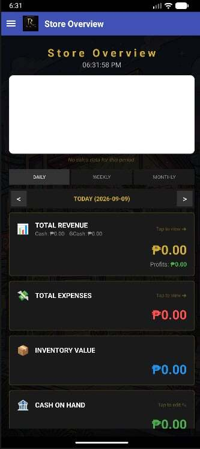
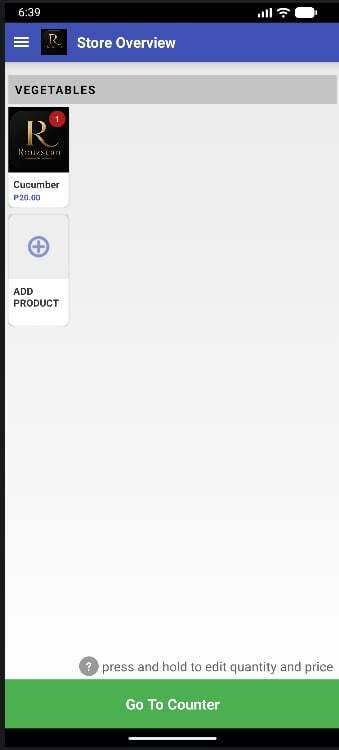
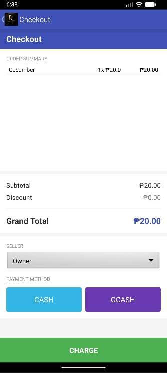
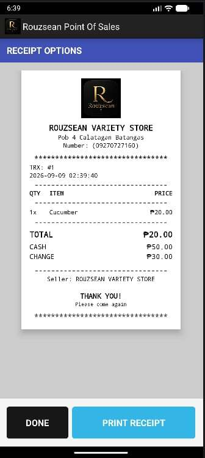
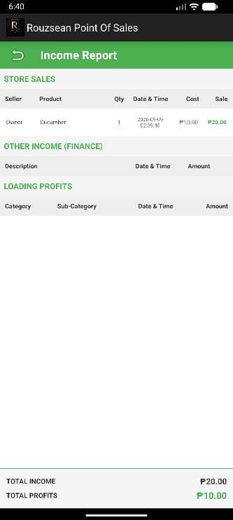
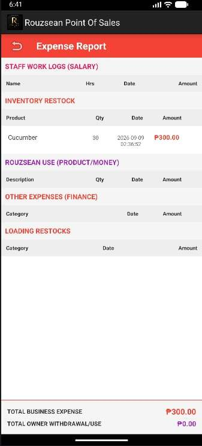

<div align="center">
  
  
  # 🛒 Rouzsean POS System

  A mobile/tablet Point of Sale (POS) application built for Android. Rouzsean POS streamlines retail and hospitality operations, offering portable transactions, real-time inventory tracking, and seamless device management directly from an Android device.

  [](https://developer.android.com)
  [](https://kotlinlang.org/)
  [](https://www.oracle.com/java/)
  [](https://developer.android.com/studio)
</div>

---

## 🚀 Features

- **📱 Portable Checkout:** Fully responsive UI optimized for both Android smartphones and tablets.
- **📷 Camera Barcode Scanning:** Utilize the device's built-in camera to quickly scan product barcodes and add items to the cart.
- **🖨️ Thermal Printer Integration:** Supports receipt printing via Bluetooth, Wi-Fi, or USB connections to standard ESC/POS printers.
- **📦 Local & Remote Inventory:** Real-time stock updates with offline caching support (never lose a sale during network drops).
- **📊 Interactive Dashboard:** Visualized daily sales, top products, and transaction history directly on the device.
- **🔒 Secure Access:** PIN-based login for Cashiers, Managers, and Admins to enforce role permissions.

---

## 🛠️ Built With

* **Languages:** **Kotlin** (Modern architecture & UI logic) & **Java** (Core systems / Legacy APIs)
* **IDE:** **Android Studio**
* **Database:** Room DB / SQLite *(or specify your remote API/Firebase backend here)*
* **Architecture:** MVVM (Model-View-ViewModel)

---

## 📸 App Preview

| Store Overview | Sale Page |
| :---: | :---: |
|  |  |

| Checkout | Receipt |
| :---: | :---: |
|  |  |

| Income Report | Expense Report |
| :---: | :---: |
|  |  |

---

## ⚙️ Getting Started

Follow these steps to get a local copy of the project up and running in Android Studio.

### 📋 Prerequisites

- **Android Studio** (Ladybug or newer recommended)
- **Android SDK** (API Level 24 or higher)
- **JDK 17** or higher
- A physical Android device or Emulator configured in Android Studio

### 🔧 Installation & Setup

1. **Clone the repository:**
   ```bash
   git clone [https://github.com/SeanRoger1007/Rouzsean-pos-system.git](https://github.com/SeanRoger1007/Rouzsean-pos-system.git)
   Open the Project:
   Downloadable Contents:
   1. Github: https://github.com/SeanRoger1007/Rouzsean-pos-system
   2. APK: https://drive.google.com/drive/u/1/folders/1TIiiORVNyprHpOgFst1h9bDJM6J2Hsdh
2. Download and Launch Android Studio.
3. Click on Open an Existing Project.
4. Navigate to the directory where you cloned Rouzsean-pos-system and select it.
5. Sync Gradle & Wait for Android Studio to finish indexing and downloading required dependencies.
6. Run the App

## 📁 Project Structure
  ```bash
Rouzsean-pos-system/
├── app/
│   ├── src/
│   │   ├── main/
│   │   │   ├── java/com/rouzsean/pos/    # Java & Kotlin Source Files
│   │   │   │   ├── data/                 # Models, Repositories, Local DB
│   │   │   │   ├── ui/                   # Activities, Fragments, ViewModels
│   │   │   │   └── utils/                # Printer helpers, Barcode scanners
│   │   │   ├── res/                      # Layout XMLs, Drawables, Strings
│   │   │   └── AndroidManifest.xml       # App Permissions & Components
│   └── build.gradle.kts                  # App-level build configurations
├── gradle/                               # Gradle wrapper files
└── build.gradle.kts                      # Project-level build configurations
